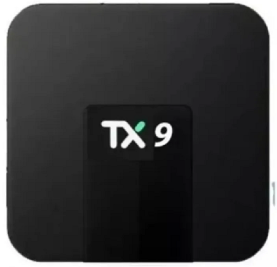
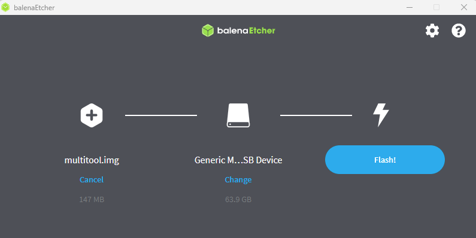
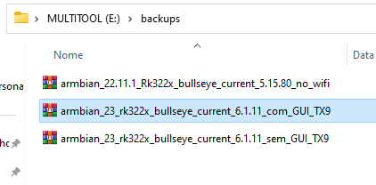
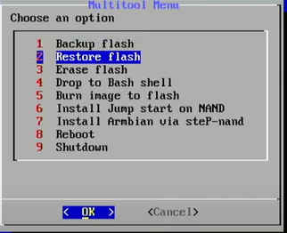

# tvbox
This is a manual explaining how to install restored firmwares in a TVBox using multitool software.

TX9 (RK3228A) model firmware is embedded with 23.02 Armbian and 6.1.11 Linux kernel, available in:
1. [Graphical Interface](https://drive.google.com/file/d/1WScjLpeaY4gGB9VgQsxyA5G8bSaFjIjr/view?usp=sharing) - (comGUI)
2. [Without Graphical Interface](https://drive.google.com/file/d/1WTwA866K6kwnVr9iloqpN70HUFS1rT9_/view?usp=sharing) - (semGUI)

Both firmwares have the same users and passwords:
1. User login: icts
2. User password: icts12345
3. root password: icts12345

**WARNING**: Due to outdated WiFi and Bluetooth drivers, they are highly unstable and unreliable. When you reboot the TV box, there is a high probability that the WiFi and Bluetooth interfaces will disappear from your screen. 

But ok, it is not the End of the World, you can also plug a Wifi Dongle in USB connector

## First Step - Download Multitool
In order to iniate the instalation, it is mandatory to download the [Multitool Software](https://users.armbian.com/jock/rk322x/multitool/multitool.img.xz) 

Burn the Multitool image on an SD Card. You can use [BalenaEtcher](https://etcher.balena.io/) to do it or other software that pleases you.

## Second Step - Select your firmware

Select the firmware and download it. Select it according to instructions above.

## Third Step - Store your firmware on SD Card

Inside SD Card, store the selected firmware into "backups" paste.

## Fourth Step - Flash the firmware on ROM Memory 

Insert the SD Card into a TV Box. Wait until the Menu Screen is displayed and choose the "Restore Flash" option. After that, select the firmware you already had saved on SD Card.

## Fifth Step - Wait

Wait until the firmware be installed in your TV Box.

**WARNING**: Be careful on this procediment, if you turn off your TV BOX when you are flashing the firmware, there is a huge probability to BRICK it!

